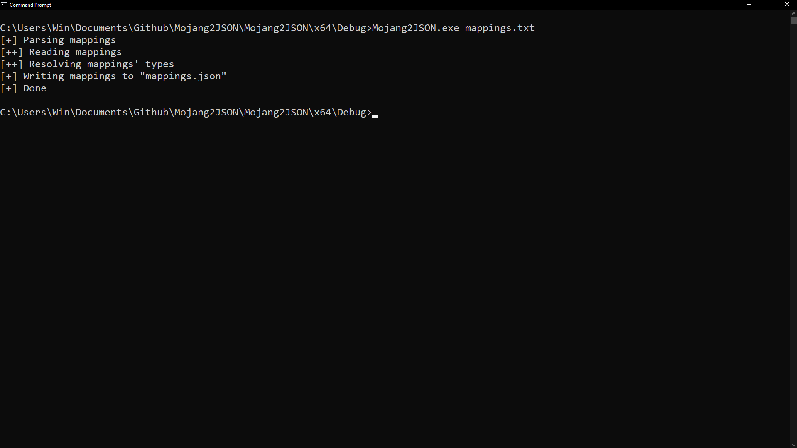
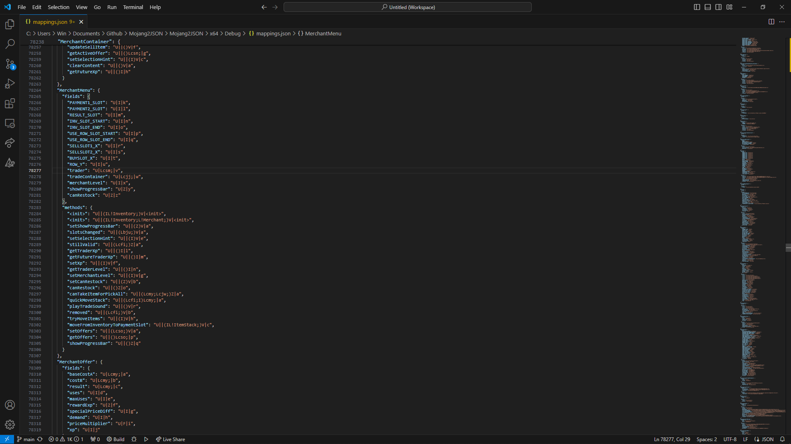

  <h3 align="center">Mojang2JSON</h3>

  

    Converts <a href="https://piston-meta.mojang.com/mc/game/version_manifest_v2.json">Mojang mappings</a> to a clean JSON format
  

## What is this

This is a program which allows you to convert <a href="https://piston-meta.mojang.com/mc/game/version_manifest_v2.json">Mojang mappings</a> to a clean JSON format. I mainly created this for use with my <a href="https://github.com/aXXo-dev/JNIMapper">JNIMapper library</a>, but you can really utilise it for anything. It currently does not resolve the static indication for fields and classes, but this is something I plan on adding in the near future.

## Build

The project is setup under Visual Studio 2022, but you can also directly download an already built binary from the releases of this repository.

## Usage

You'll need to gather appropriate Mojang client mappings for the Minecraft version you want to target by going though <a href="https://piston-meta.mojang.com/mc/game/version_manifest_v2.json">their manifests</a>. Simply save them as a text file and run `<Mojang2JSON> <mappings.txt>`. A `mappings.json` file will be outputed.

### Footage

## Licensing

This project is licensed under the <a href="https://opensource.org/license/mit">MIT license</a>, and all contributions made directly to it. You can basically use this software commercially and without any restrictions whatsoever.
